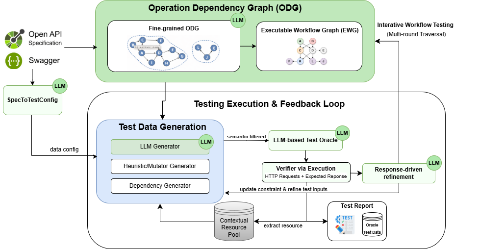

# APIPilot: REST API Testing with Verified LLM-Inferred Dependencies and Response-Driven Refinement
APIPilot is a verification-guided framework for REST API testing that infers and validates operation dependencies using LLMs and execution feedback, enabling reliable workflow generation and iterative refinement.
## Architecture


## Available Baseline Tools

- **RESTifAI** (`RESTifAI`): A LLM-based REST API testing framework designed to generate reusable and executable production-ready test suites. The approach validates OpenAPI specifications through structural conformance testing and verifying business logic scenarios through functional test case generation.
  *Reference*: https://doi.org/10.48550/arXiv.2512.08706
  *Repository*: https://github.com/casablancahotelsoftware/RESTifAI

- **AutoRestTest** (`AutoRestTest`): A mutation-based API testing methodology that leverages LLM-generated request values combined with reinforcement learning techniques to maximize the detection of unique HTTP 500 server errors and successful 2xx responses across distinct API operations.  
  *Reference*: https://doi.org/10.48550/arXiv.2501.08600  
  *Repository*: https://github.com/selab-gatech/AutoRestTest/

- **KAT** (`KAT`): A novel AI-driven approach that leverages the large language model GPT in conjunction with advanced prompting techniques to autonomously generate test cases to validate RESTful APIs.  
  *Reference*: https://doi.org/10.48550/arXiv.2407.10227
   
## Evaluation Dataset: API Services

The experimental evaluation encompasses 11 diverse REST API services, selected to represent varying complexity levels and domain-specific characteristics:

#### Locally Deployed Services

- **genome-nexus**: A bioinformatics service providing genomic variant annotation capabilities  
  *Source*: https://github.com/genome-nexus/genome-nexus
- **language-tool**: A natural language processing service offering grammar and linguistic analysis  
  *Source*: https://github.com/languagetool-org/languagetool  
- **rest-countries**: A geographical information service providing country-specific metadata  
  *Source*: https://github.com/apilayer/restcountries
- **GitLab**: A web-based DevOps lifecycle tool providing Git repository management, issue tracking, and CI/CD pipeline features
  *Source*: https://gitlab.com/gitlab-org/gitlab
- **Jhipster Sample Application**: Jhipster Sample Application API
  *Source*: https://github.com/jhipster/jhipster-sample-app
- **Petstore**: This is a sample server Petstore server.
  *Source*: https://github.com/swagger-api/swagger-petstore
- **Spring PetClinic**: Spring PetClinic Sample Application.

  *Source*: https://github.com/spring-projects/spring-petclinic
#### Remotely Hosted Services
- **Bills API**: API to get and search for information regarding Bills, their stages, associated amendments and publications.
- **Canada Holidays API**: This API lists all 31 public holidays for all 13 provinces and territories in Canada, including federal holidays.
- **fdic**: Federal Deposit Insurance Corporation banking institution data service  
  *Documentation*: https://api.fdic.gov/banks/docs/
- **ohsome**: OpenStreetMap geospatial data analysis and statistics service  
  *Documentation*: https://docs.ohsome.org/ohsome-api/v1/

**Happy testing! 🚀**

---

## How to use the tool

This section shows common ways to run the repository and use the main APIs programmatically.

1) Quick demo (recommended)

```bash
# create venv and install deps
python -m venv .venv
source .venv/bin/activate
pip install -r requirements.txt

# run the demo (edit demo.py to set your LLM keys safely)
python demo.py
```

2) Run programmatically from Python

```python
from api_testing import APITesting
from api_testing.models.llms.openai_model import OpenAIModel
from api_testing.models.embedding_models.huggingface_embedding_model import HuggingfaceEmbeddingModel

llm = OpenAIModel(model="gpt-4.1-mini", api_key="<YOUR_KEY>")
embedder = HuggingfaceEmbeddingModel()

tester = APITesting(
  base_url="https://api.ohsome.org/v1",
  spec_path="datasets/ohsome.json",
  model=llm,
  embedder=embedder,
)

# Run end-to-end test generations
tester.run_tests(num_generations=2, num_test_cases=30, mutation_ratio=0.2)
```

3) Advanced: use `Executor` directly

```python
from api_testing.generators.executor import Executor, Strategy

# Construct Executor with an operation from the parsed spec (see SpecificationParser)
executor = Executor(
  api_url="https://api.example.com",
  strategy=Strategy.NAIVE_VALUE,
  operation=<OperationProperties instance>,
  cache_dir=".cache/example",
  num_test_cases=10,
)

# Generate and execute requests; returns recorded entries
entries = executor.exec()
```

Notes:
- Replace `<YOUR_KEY>` with your LLM API key or configure environment variables.
- Use `SpecificationParser` to parse OpenAPI/Swagger files and obtain `OperationProperties` objects when using `Executor` directly. For most use-cases, `APITesting` and `demo.py` already show practical end-to-end flows.

If you'd like, I can expand the `Executor` example to show how to build an `OperationProperties` from a spec or add a complete runnable snippet that uses a local sample spec.