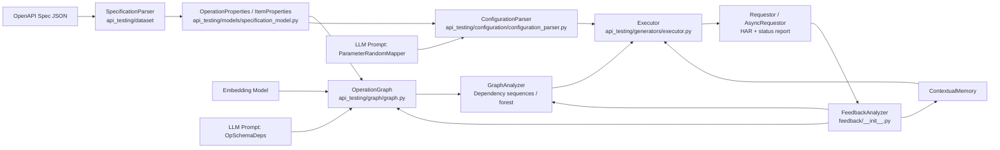
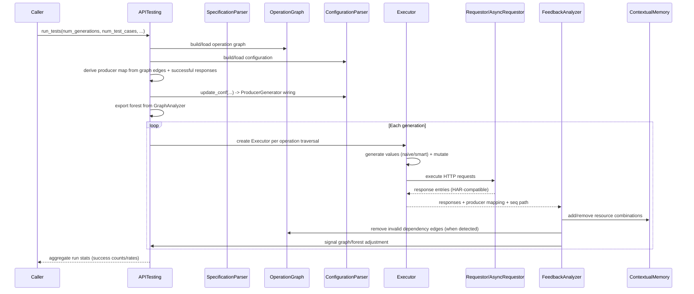

# APITesting Architecture

## Purpose and audience

This document explains how `api_testing` is structured and how a full test run executes end to end.

It is optimized for:

- contributors extending generators, model adapters, prompts, or execution behavior;
- researchers mapping runtime behavior to artifacts (HAR history, dependency graph, reports).

---

## System at a glance

`api_testing` is an OpenAPI-driven API testing framework with five major phases:

1. Parse and normalize API specification.
2. Infer operation dependencies (heuristic + LLM-assisted mapping).
3. Build parameter/request-body generation configuration.
4. Generate and execute requests (sync or async), persist run history.
5. Analyze feedback and adapt dependency usage across generations.

Primary orchestrator: `api_testing/__init__.py` (`APITesting` class).

---

## Layered architecture



---

## Runtime flow (`APITesting.run_tests`)



### Detailed lifecycle

1. **Bootstrap (`APITesting._load_`)**
   - Parses spec through `SpecificationParser`.
   - Resolves `base_title`, `base_url`, and project cache directory at `.cache/<api_title>/`.
   - Initializes logging (`api_testing/utils/log.py`) and token tracker (`utils/llm_tracker.py`).
   - Loads cached `specification.json` or builds it.

2. **Graph + configuration setup**
   - `OperationGraph` loads from `semantic_property_dependency_graph.json` or creates graph.
   - `ConfigurationParser` loads `configuration.json` or derives field generators.
   - In async setup mode, graph/config can be built in parallel via `ThreadPoolExecutor`.

3. **Producer mapping projection**
   - For each graph edge, source response fields are flattened (`flatten_json_schema`) and mapped to consumer parameters.
   - `ConfigurationParser.update_conf(...)` rewrites selected fields as `ProducerGenerator` so later requests can consume values from contextual memory.

4. **Traversal strategy**
   - `GraphAnalyzer.export_to_forest()` builds execution trees from dependency sequences.
   - Sync mode: depth-first traversal per tree.
   - Async mode: parallel root tree execution with bounded concurrency; each tree keeps sequential dependency ordering.

5. **Request generation + execution**
   - `Executor` merges operation schema with field configuration (`merge_config`).
   - Strategy currently used in orchestrator: `Strategy.NAIVE_VALUE` (with optional mutation).
   - Requests are dispatched by:
     - `Requestor` (sync, threaded requests, batched flush), or
     - `AsyncRequestor` + `AsyncRequestBatch` (async/httpx + semaphore).

6. **Feedback loop**
   - `FeedbackAnalyzer.evaluate(...)` inspects unexpected 4xx entries, optionally calls `FeedBackJudge` prompt.
   - Semantic errors are grouped and cached via `SemanticErrorMemory` (FAISS).
   - `adjust(...)` may remove invalid source->target parameter mappings from graph and dependency sequences.

7. **State propagation**
   - Successful responses are folded into `ContextualMemory` for downstream producer consumption.
   - Context is merged back after parallel async tree execution.

---

## Package map and responsibilities

### Orchestration

- `api_testing/__init__.py`
  - Defines `APITesting` entry point.
  - Handles loading, graph/config initialization, generation loops, traversal, and high-level runtime statistics.

### Specification and schema domain

- `api_testing/dataset/specification_parser.py`
  - Parses OpenAPI using bundled `prance` resolver.
  - Produces `OperationProperties`, `ParameterProperties`, `ResponseProperties`, `ItemProperties`.
  - Caches parsed spec as `.cache/<api>/specification.json`.

- `api_testing/models/specification_model.py`
  - Core domain model for operation/request/response metadata.
  - Provides helpers such as `successful_responses`, `schemas`, flatten-friendly views.

### Dependency graph inference

- `api_testing/graph/graph.py` (`OperationGraph`)
  - Creates operation nodes and dependency edges.
  - Combines heuristic similarity and GPT schema-parameter mapping (`prompts/op_schema_deps`).
  - Persists graph JSON and optional graph visualizations.

- `api_testing/graph/graph_analyzer.py` (`GraphAnalyzer`)
  - Builds dependency sequences and execution forest.
  - Supports runtime pruning updates when feedback invalidates mappings.

### Configuration synthesis

- `api_testing/configuration/configuration_parser.py`
  - Maps parameters/request-body fields to concrete generators.
  - Uses heuristic mapping first; unresolved fields become GPT-mapped in batches (`PENDING_GPT`).
  - Updates configuration dynamically with producer dependencies.

- `api_testing/models/configuration_model.py`
  - Dataclasses for `OperationConfiguration` and `FieldConfiguration`.

### Value generation and HTTP execution

- `api_testing/generators/executor.py`
  - Integrates operation schema + field strategies.
  - Generates request candidates (naive or smart), mutates for negative cases, and executes.

- `api_testing/generators/naive_value_generator.py`
  - Builds combinational test cases, drives placeholders, mutation, semantic filtering.
  - Uses cache `combination.json`.

- `api_testing/generators/smart_value_generator.py`
  - LLM-generated request values via `prompts/smart_value_generate`.

- `api_testing/generators/requestor.py` / `api_testing/generators/async_requestor.py`
  - MIME-aware request encoding, path/query handling, HAR persistence, status report updates.

- `api_testing/models/http_data.py`
  - Request/response transport models used by requestors.

### Feedback, memory, and adaptation

- `api_testing/feedback/__init__.py` (`FeedbackAnalyzer`)
  - Evaluates invalid results and determines likely corrective action categories.
  - Can trigger dependency edge removals.

- `api_testing/feedback/semantic_error_memory.py`
  - Embedding-backed semantic cache for previously diagnosed errors.

- `api_testing/memory/contextual_memory.py`
  - Stores extracted entities/resources from successful responses.
  - Supports producer lookups, priority resources, black/white-listing, merge operations.

- `api_testing/memory/vectordb/*`
  - Vector DB abstraction and Qdrant implementation (`APITestingVectorDB`, `QdrantDB`).

### Prompt contracts

- `api_testing/prompts/*`
  - Prompt wrappers and Pydantic schema contracts for:
    - operation-schema dependency mapping,
    - generator-class mapping,
    - smart value generation,
    - semantic oracle filtering,
    - feedback judgment,
    - request-response constraints.

### Utilities and tracing

- `api_testing/utils/__init__.py`
  - Schema flattening, combination generation, body parameter extraction, generic conversions.
- `api_testing/utils/log.py`
  - Runtime logger configuration.
- `api_testing/utils/llm_tracker.py`
  - Token usage file tracker per model.
- `api_testing/tracing/tracing.py`
  - Additional trace manager abstraction (currently optional/commented in orchestrator).

### Out-of-package reporting tool

- `endpoint_500_report.py`
  - Standalone CLI that scans HAR history and emits endpoint-level 500 coverage report.
  - Not part of `api_testing` package runtime path.

---

## Data contracts and artifact lineage

### Core runtime contracts

- **Specification contract**: `OperationProperties` tree loaded from OpenAPI and cached in `specification.json`.
- **Graph contract**: operation UUID nodes + similarity edges in `semantic_property_dependency_graph.json`.
- **Configuration contract**: per-operation field generator map in `configuration.json`.
- **Execution contract**: HAR-compatible entries under `history/*.har` plus `reports.json`.
- **Feedback contract**: invalid-case diagnosis and dynamic graph/memory adjustments.

### Cache directory layout

Typical run directory: `.cache/<api_title>/`

```text
.cache/<api_title>/
  baseline_specification.<json|yaml>
  specification.json
  configuration.json
  semantic_property_dependency_graph.json
  heuristic_edges.json
  gpt_edges.json
  dependency_sequences.json
  contextual_memory.json
  error_memory.json
  reports.json
  <llm_model>_usages.json
  combination.json
  logs/
    <llm_model>.log
  history/
    <session_id>.har
```

---

## Concurrency model

Two levels of concurrency are used:

1. **Setup concurrency** (optional): graph and configuration initialization in parallel threads.
2. **Request concurrency**:
   - sync mode: thread pool around blocking `requests` calls;
   - async mode: `httpx.AsyncClient` + semaphore, plus optional parallel execution of independent root trees.

Synchronization points include:

- status report writes (`Requestor`/`AsyncRequestor` locks),
- HAR flush batching,
- context merge after async tree execution,
- forest update lock during async feedback adjustments.

---

## Extension guide for contributors

### Add a new LLM provider

1. Implement adapter in `api_testing/models/llms/<provider>_model.py` extending `APITestingBaseLLMModel`.
2. Implement `load_model`, `generate`, `a_generate`, `get_model_name`.
3. Export from `api_testing/models/llms/__init__.py` and optionally `api_testing/models/__init__.py`.
4. Verify structured-output compatibility with prompt schemas.

### Add a new embedding provider

1. Implement adapter in `api_testing/models/embedding_models/` extending `APITestingBaseEmbeddingModel`.
2. Ensure both single-text and batch embedding paths are present (`embed_text`, `embed_texts`).
3. Export in `api_testing/models/embedding_models/__init__.py`.

### Add a new random generator

1. Implement generator class in `api_testing/inputs/`.
2. Register class in `RandomGeneratorFactory._registries` (`api_testing/inputs/__init__.py`).
3. If needed, update mapper prompt descriptions used by configuration parser.

### Add a new prompt-driven reasoning stage

1. Create prompt package in `api_testing/prompts/<name>/` with schema.
2. Implement wrapper class with `.exec()` and optional `.a_exec()`.
3. Integrate call site in graph/config/generation/feedback pipeline.
4. Ensure deterministic parsing and fallback behavior for malformed model output.

### Add a new execution strategy

1. Add enum value in `Strategy` (`api_testing/generators/executor.py`).
2. Implement generation path and strategy switch handling.
3. Wire orchestration call site (currently defaults to `NAIVE_VALUE`).

---

## Research and reproducibility notes

- Result quality depends on external LLM and embedding models, prompting contracts, and random generation paths.
- Request combinations and mutation are partially randomized; deterministic replay is limited unless randomness is controlled consistently.
- `.cache` captures enough intermediate artifacts to inspect graph, config, and response history after each run.
- Endpoint-level 500 coverage can be derived reproducibly from HAR files via `endpoint_500_report.py`.

---

## Known architecture constraints and technical debt

Current hotspots worth noting for future maintainers:

- `api_testing/__init__.py` contains broad orchestration logic and could be decomposed into smaller services.
- Naming consistency varies across modules (e.g., mixed casing and spelling in some files/methods).
- Some features are optional/partially wired (e.g., advanced tracing manager, alternate strategies).
- Adapter exports in `models/llms/__init__.py` currently expose a subset of concrete implementations.

These do not block current operation but increase onboarding and change risk.

---

## Practical entry points

- End-to-end usage reference: `demo.py`.
- Programmatic runtime orchestrator: `api_testing/__init__.py` (`APITesting`).
- Fastest path to understand request execution behavior: `api_testing/generators/executor.py` + `api_testing/generators/requestor.py`.
- Fastest path to understand dependency inference: `api_testing/graph/graph.py` + `api_testing/graph/graph_analyzer.py`.
