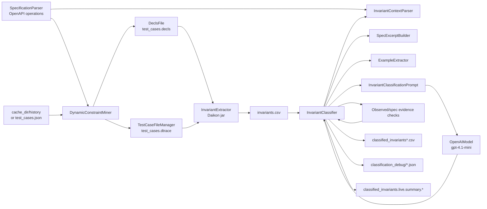
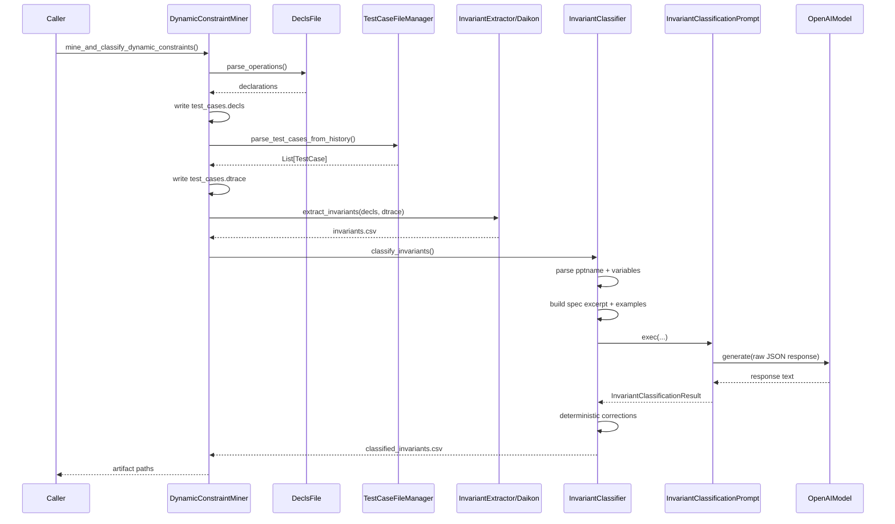
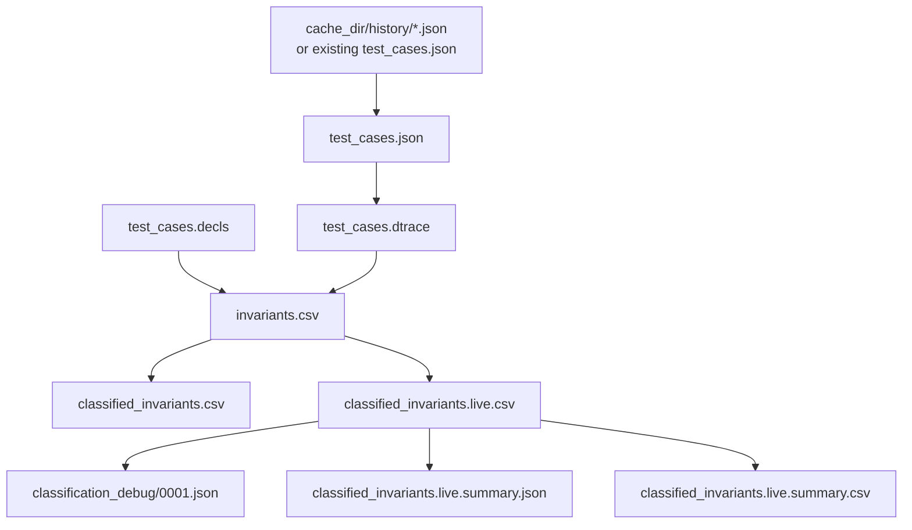

# Dynamic Constraint Mining

This document explains the full `DynamicConstraintMiner` flow: starting from
cached API test cases, generating `.decls` / `.dtrace`, running Daikon to create
`invariants.csv`, and then using `InvariantClassifier` to classify invariants
with an LLM.

The goal is to help new contributors:

- understand how the pipeline works end to end;
- know which component owns each part of the workflow;
- read `.csv`, debug JSON, and summary JSON/CSV artifacts;
- operate the live classifier runner without overwriting existing artifacts;
- understand how the current Python implementation differs from the original
  Java extension.

## Quick Mental Model

```text
OpenAPI spec + cached test history
  -> DynamicConstraintMiner
  -> test_cases.decls + test_cases.dtrace
  -> Daikon / InvariantExtractor
  -> invariants.csv
  -> InvariantClassifier + LLM + deterministic checks
  -> classified_invariants.csv
```

The pipeline has two major phases:

1. **Extract invariants**: convert request/response history into Daikon input,
   then run Daikon to discover candidate invariants.
2. **Classify invariants**: give each invariant OpenAPI context, observed
   examples, and an LLM prompt, then assign one of `true-positive`,
   `false-positive`, or `inconclusive`.

## Main Entry Points

The main code entry points are:

- `api_testing/constraint/dynamic_constraint_miner.py`
- `api_testing/constraint/dynamic_constraints/invariant_extractor.py`
- `api_testing/constraint/dynamic_constraints/invariant_classifier.py`
- `scripts/run_invariant_classifier_live.py`

### `DynamicConstraintMiner.mine_dynamic_constraints()`

Run the extraction-only flow:

```python
artifacts = miner.mine_dynamic_constraints()

print(artifacts["decls_path"])
print(artifacts["dtrace_path"])
print(artifacts["invariants_path"])
```

Default outputs under `cache_dir`:

- `test_cases.decls`
- `test_cases.dtrace`
- `invariants.csv`

### `DynamicConstraintMiner.classify_invariants()`

Classify an existing `cache_dir/invariants.csv` file:

```python
classified_path = miner.classify_invariants(
    persist_debug_artifacts=True,
)
```

Default outputs:

- `classified_invariants.csv`
- optional `classification_debug/*.json`

### `DynamicConstraintMiner.mine_and_classify_dynamic_constraints()`

Run the end-to-end flow:

```python
artifacts = miner.mine_and_classify_dynamic_constraints(
    persist_debug_artifacts=True,
)

print(artifacts["decls_path"])
print(artifacts["dtrace_path"])
print(artifacts["invariants_path"])
print(artifacts["classified_invariants_path"])
```

### `scripts/run_invariant_classifier_live.py`

This runner is dedicated to live LLM classification over the current cache
directories:

```powershell
$env:OPENAI_API_KEY = "<your key>"
.venv/Scripts/python.exe scripts/run_invariant_classifier_live.py
```

Runner defaults:

- model: `gpt-4.1-mini`
- output: `classified_invariants.live.csv`
- resume: `RESUME = True`
- concurrency: `MAX_WORKERS = 4`
- debug: `PERSIST_DEBUG_ARTIFACTS = True`
- summary:
  - `classified_invariants.live.summary.json`
  - `classified_invariants.live.summary.csv`

## Component Diagram



## Sequence Diagram



## Artifact Lifecycle



## Extract Phase

The extraction flow is orchestrated by `DynamicConstraintMiner`.

### 1. Build `.decls`

`extract_decls_classes()` creates a `DeclsFile` from parsed OpenAPI operations.

Key behavior:

- reads `spec_parser.operations`;
- creates Daikon program points for API operations;
- persists `cache_dir/test_cases.decls`.

`DeclsFile` owns the mapping between API operations, request parameters/body
fields, response fields, and Daikon variable declarations.

### 2. Build `.dtrace`

`extract_dtraces()` uses `TestCaseFileManager` to:

- parse cached request/response history;
- persist `test_cases.json`;
- generate the Daikon trace file `test_cases.dtrace`.

`generate_dtrace_file()` iterates over `TestCase` objects and matched Daikon
declaration classes. Each successful request/response contributes variable
values for Daikon.

### 3. Run Daikon

`extract_invariants()` checks that these files exist:

- `test_cases.decls`
- `test_cases.dtrace`

Then `InvariantExtractor.extract_invariants()` runs the Daikon jar and writes:

```text
cache_dir/invariants.csv
```

The `invariants.csv` header contract is:

```csv
pptname;invariant;invariantType;variables;postmanAssertion
```

## Classify Phase

`InvariantClassifier` reads `invariants.csv`, normalizes each row, builds LLM
context, applies deterministic evidence checks, and writes classified output.
For a focused deep dive into spec excerpt budgets and deterministic evidence
checks, see
[`invariant_classifier_internals.md`](invariant_classifier_internals.md).

Internal per-row flow:

```text
InvariantRecord
  -> InvariantContextParser
  -> SpecExcerptBuilder
  -> ExampleExtractor
  -> observed/spec evidence checks
  -> InvariantClassificationPrompt
  -> LLM response parser/repair
  -> deterministic correction
  -> output CSV row + debug JSON + summary row
```

### Main Components

| Component | Responsibility |
| --- | --- |
| `InvariantReader` | Reads `invariants.csv` with `;` delimiter and validates the header. |
| `InvariantContextParser` | Parses `pptname`, variables, `ENTER`/`EXIT`, and invariant type descriptions. |
| `SpecExcerptBuilder` | Builds a compact OpenAPI excerpt relevant to the variables in the invariant. |
| `ExampleExtractor` | Recovers concrete examples from cached `test_cases.json` / `history`. |
| `InvariantClassificationPrompt` | Renders the prompt, calls the LLM, and parses/repairs JSON responses. |
| `evidence_checker` | Performs deterministic checks over observed examples and documented enum relationships. |
| `InvariantClassifier` | Orchestrates per-row classification, resume, concurrency, output, debug, and summary. |

### Verdict Meaning

| Verdict | Meaning |
| --- | --- |
| `true-positive` | The invariant is likely a valid API contract for valid requests/responses. |
| `false-positive` | The invariant is likely an observed-execution artifact or overfit, not a stable API contract. |
| `inconclusive` | Context is insufficient, parsing failed, or the evidence is not strong enough to decide. |

### Resume, Concurrency, Cost Guard

`InvariantClassifier.classify_invariants()` currently supports:

- `resume=True`: skips rows already present in the output CSV using a stable row key.
- `max_workers`: uses `ThreadPoolExecutor` for limited concurrency over sync LLM calls.
- `max_rows`: limits the number of rows to classify.
- `summary_json_path` / `summary_csv_path`: writes aggregate summaries.
- `persist_debug_artifacts=True`: writes per-row debug JSON files.

The live runner exposes these knobs as easy-to-edit constants:

```python
MODEL_NAME = "gpt-4.1-mini"
RESUME = True
MAX_WORKERS = 4
MAX_ROWS = None
LIMIT = None
```

## Output Files

### `invariants.csv`

Delimiter: `;`

| Field | Meaning |
| --- | --- |
| `pptname` | Daikon program point. Encodes operation key, status code, optional response container path, and `ENTER`/`EXIT`. |
| `invariant` | Invariant expression discovered by Daikon, for example `return.id >= 1`. |
| `invariantType` | Daikon invariant class, for example `daikon.inv.unary.scalar.LowerBound`. |
| `variables` | Variables involved in the invariant; used by the context parser. |
| `postmanAssertion` | Assertion text/script from the exporter, when available. |

Example:

```csv
pptname;invariant;invariantType;variables;postmanAssertion
get-/api/v1/BillTypes&get-/api/v1/BillTypes&200&items():::EXIT;return.category one of { "Hybrid", "Private", "Public" };daikon.inv.unary.string.OneOfString;return.category;
```

### `classified_invariants.csv` / `classified_invariants.live.csv`

Delimiter: `;`

Header:

```csv
pptname;invariant;invariantType;variables;postmanAssertion;verdict;confidence;reason;model;promptVersion;examplesCount;approxNumberOfOperations
```

Additional fields:

| Field | Meaning |
| --- | --- |
| `verdict` | `true-positive`, `false-positive`, or `inconclusive`. |
| `confidence` | Float in `[0.0, 1.0]`; output CSV uses 4 decimal places. |
| `reason` | Short explanation from the LLM or deterministic correction. |
| `model` | Model used, for example `gpt-4.1-mini`. |
| `promptVersion` | Prompt/version tag, currently `main2-python-v1`. |
| `examplesCount` | Number of concrete examples recovered for this row. |
| `approxNumberOfOperations` | Number of cached test cases in `cache_dir`; this is a cache-local approximation. |

Example:

```csv
get-/api/v1/BillTypes&get-/api/v1/BillTypes&200&items():::EXIT;return.category one of { "Hybrid", "Private", "Public" };daikon.inv.unary.string.OneOfString;return.category;;true-positive;0.9500;The invariant matches the documented enum values for return.category.;gpt-4.1-mini;main2-python-v1;3;1258
```

### `classification_debug/*.json`

When `persist_debug_artifacts=True`, each row gets one file:

```text
cache_dir/classification_debug/0001.json
cache_dir/classification_debug/0002.json
...
```

Important fields:

| Field | Meaning |
| --- | --- |
| `row_index` | 1-based row index in the input CSV. |
| `row_key` | SHA-256 stable key derived from the 5 raw invariant identity fields. |
| `status` | `success`, `error`, or a resume/processing-related row status. |
| `record` | Raw invariant row. |
| `normalized_context` | Parsed operation, program point, input variables, and output variables. |
| `spec_excerpt` | OpenAPI context sent to the prompt. |
| `spec_excerpt_debug` | Shape, budget profile, and selected schema paths. |
| `examples` | Concrete assignments recovered from test cases. |
| `observed_evidence` | Deterministic check over examples. |
| `spec_enum_evidence` | Deterministic check for `one of` invariants against OpenAPI enums. |
| `deterministic_correction` | Present when deterministic evidence overrides the LLM result. |
| `result` | Structured final result. |
| `error` | Exception summary when the row falls back to `inconclusive`. |

Simplified example:

```json
{
  "row_index": 3,
  "row_key": "f4a1...",
  "status": "success",
  "record": {
    "pptname": "get-/api/v1/BillTypes&get-/api/v1/BillTypes&200&items():::EXIT",
    "invariant": "return.category one of { \"Hybrid\", \"Private\", \"Public\" }",
    "invariant_type": "daikon.inv.unary.string.OneOfString",
    "variables": "return.category",
    "postman_assertion": ""
  },
  "normalized_context": {
    "parsed_program_point": {
      "operation_key": "get-/api/v1/BillTypes",
      "http_method": "GET",
      "endpoint_path": "/api/v1/BillTypes",
      "status_code": "200",
      "program_point": "EXIT",
      "response_container_path": "items[]"
    }
  },
  "spec_excerpt": "Endpoint: GET /api/v1/BillTypes\nRelevant response fields...",
  "examples": [
    "return.category=\"Public\"",
    "return.category=\"Private\"",
    "return.category=\"Hybrid\""
  ],
  "observed_evidence": {
    "status": "evaluated",
    "support_count": 3,
    "contradiction_count": 0
  },
  "spec_enum_evidence": {
    "status": "exact"
  },
  "result": {
    "verdict": "true-positive",
    "confidence": 0.95,
    "reason": "The invariant matches the documented enum."
  }
}
```

### `classified_invariants.live.summary.json`

Aggregate summary for a live run.

Important fields:

| Field | Meaning |
| --- | --- |
| `total_records` | Number of input rows considered. |
| `completed_records` | Number of rows with summary entries. |
| `skipped_records` | Number of rows skipped because `resume=True`. |
| `processed_records` | Number of rows classified in the current run. |
| `interrupted` | `true` if the run was interrupted. |
| `verdict_counts` | Counts by verdict. |
| `status_counts` | Counts by status (`success`, `skipped`, `error`). |
| `technical_failure_count` | Number of rows with status `error`. |
| `low_confidence_count` | Number of rows with `confidence <= 0.5`. |
| `technical_failures` | List of technical-failure rows. |
| `low_confidence_rows` | List of rows that need manual inspection. |
| `model` | Model used for the run. |
| `prompt_version` | Prompt version. |
| `max_workers` | Worker count. |
| `input_path` / `output_path` | Artifact paths. |
| `debug_dir` | Debug JSON directory, when enabled. |
| `started_at` / `finished_at` | ISO timestamps. |
| `duration_seconds` | Runtime of the summary-writing run. |

Simplified example:

```json
{
  "total_records": 1744,
  "completed_records": 1744,
  "skipped_records": 1,
  "processed_records": 1743,
  "interrupted": false,
  "verdict_counts": {
    "inconclusive": 396,
    "false-positive": 894,
    "true-positive": 454
  },
  "status_counts": {
    "skipped": 1,
    "success": 1743
  },
  "technical_failure_count": 0,
  "low_confidence_count": 44,
  "model": "gpt-4.1-mini",
  "prompt_version": "main2-python-v1",
  "max_workers": 4
}
```

### `classified_invariants.live.summary.csv`

Row-level summary for spreadsheet filtering and sorting.

Header:

```csv
row_index,row_key,status,pptname,invariant,invariant_type,verdict,confidence,reason,model,prompt_version,examples_count,approx_number_of_operations,duration_seconds
```

Use cases:

- filter `status == error`;
- sort by `confidence <= 0.5`;
- inspect `inconclusive`;
- compare rows skipped by resume with rows processed in the latest run.

## Operations Runbook

### Extract Only

```python
from api_testing.constraint.dynamic_constraint_miner import DynamicConstraintMiner

miner = DynamicConstraintMiner(
    spec_parser=spec,
    cache_dir=".cache/Bills API_3",
)

artifacts = miner.mine_dynamic_constraints()
```

### Classify Existing `invariants.csv`

```python
from api_testing.constraint.dynamic_constraints.invariant_classifier import InvariantClassifier
from api_testing.models.llms.openai_model import OpenAIModel

model = OpenAIModel(model="gpt-4.1-mini")
classifier = InvariantClassifier(
    spec_parser=spec,
    model=model,
    cache_dir=".cache/Bills API_3",
)

classified_path = classifier.classify_invariants(
    persist_debug_artifacts=True,
)
```

### Run Live Classifier Across Current Cache Dirs

```powershell
$env:OPENAI_API_KEY = "<your key>"
.venv/Scripts/python.exe scripts/run_invariant_classifier_live.py
```

Before a full run, inspect these constants in
`scripts/run_invariant_classifier_live.py`:

- `DATASET_TO_CACHE_DIR`
- `MODEL_NAME`
- `OUTPUT_FILENAME`
- `RESUME`
- `MAX_WORKERS`
- `MAX_ROWS`
- `LIMIT`

Practical guidance:

- Use `LIMIT` for smoke testing to avoid unexpected API cost.
- Keep `OUTPUT_FILENAME = "classified_invariants.live.csv"` to avoid
  overwriting `classified_invariants.csv`.
- Keep `RESUME = True` for long runs.
- Lower `MAX_WORKERS` if provider rate limits appear.

## Porting Notes From Java Extension

The original reference implementation lives under:

```text
extensions/2025-SWQD-LLM-Invariant-classification/InvariantClassifier
```

Important Java files:

| Java file | Role in original extension |
| --- | --- |
| `Main2.java` | Main benchmark runner over AGORA datasets. |
| `PromptGenerator.java` | Builds Swagger/invariant/examples prompt text. |
| `LLMClassifierWithConfidence.java` | Calls OpenAI chat/function-calling and returns verdict/confidence/tokens. |
| `GPTModel.java` | Enumerates OpenAI model identifiers and reads `OPENAI_API_KEY`. |
| `agora_data/**` | Benchmark specs, invariants, and call data. |
| `results/**` / `results_improved_prompt/**` | Per-id prompt/response/result benchmark artifacts. |

### What Was Ported Conceptually

| Original idea | Python implementation |
| --- | --- |
| Ask the LLM whether an invariant is `true-positive` or `false-positive`. | `InvariantClassificationPrompt` asks for `true-positive`, `false-positive`, or `inconclusive`. |
| Include Swagger/OpenAPI context. | `SpecExcerptBuilder` builds a compact relevant OpenAPI excerpt. |
| Include invariant type description. | `InvariantContextParser` loads descriptions from `invariant_kinds.txt`. |
| Include observed examples from API calls. | `ExampleExtractor` recovers examples from `test_cases.json` / `history`. |
| Store model verdict and confidence. | `classified_invariants*.csv` stores `verdict`, `confidence`, `reason`, `model`, and `promptVersion`. |
| Persist per-invariant debug artifacts. | `classification_debug/*.json` stores richer structured prompt context and evidence. |

### Improvements In Current Python Implementation

- Integrated into project-native `DynamicConstraintMiner` instead of a
  standalone AGORA benchmark runner.
- Supports `inconclusive`, which is safer than forcing uncertain rows into
  TP/FP.
- Uses Pydantic schema validation for classifier results.
- Repairs safe structured-output slips such as fenced JSON and
  `"confidence": "high"` before validation.
- Supports resume from an existing output CSV.
- Supports limited concurrency with `ThreadPoolExecutor`.
- Supports `max_rows` / `LIMIT` for smoke runs and cost control.
- Writes aggregate summary JSON/CSV.
- Builds debug JSON with normalized context, selected schema paths, examples,
  observed evidence, enum evidence, and deterministic corrections.
- Applies deterministic corrections for observed contradictions and documented
  enum relationships.
- Uses `gpt-4.1-mini` as the default live model.

### Not Ported 100%

| Area | Current note |
| --- | --- |
| AGORA dataset abstraction | The Python flow uses this project's cache/spec/test-case layout, not Java `AgoraDataSet` classes. |
| Exact `APISpecFilter` YAML behavior | Python uses `SpecExcerptBuilder`, a compact structured excerpt tailored to current OpenAPI models. |
| OpenAI function-calling parity | The Python prompt wrapper parses/repairs JSON locally; token usage is not persisted like Java `promptTokens`/`completionTokens`. |
| Research result tables/ROC scripts | Java `results.csv`, ROC, and benchmark analysis scripts are not ported as runtime features. |
| Per-id `prompt.txt` / `response.md` / `result.json` layout | Python uses one structured debug JSON file per row instead. |
| Multi-dataset `maxNumberOfOperations` semantics | Python `approxNumberOfOperations` is a cache-local test-case count, not the AGORA cross-dataset max call count. |
| Forced binary verdict | Python intentionally adds `inconclusive` for safer production behavior. |

## Appendix: Live Snapshot From Current 8 Cache Dirs

Snapshot context:

- Date: 2026-04-22
- Runner: `scripts/run_invariant_classifier_live.py`
- Main model: `gpt-4.1-mini`
- Output: `classified_invariants.live.csv`
- Summary files: `classified_invariants.live.summary.{json,csv}`
- Note: some resumed rows in GitLab/Canada cache dirs were produced before the
  default model switch and still show `gpt-4o-mini`; this is expected when
  `RESUME=True`.

Aggregate:

| Metric | Count |
| --- | ---: |
| Total classified rows | 6545 |
| `true-positive` | 1604 |
| `false-positive` | 3696 |
| `inconclusive` | 1245 |
| Technical failures in summaries | 0 |

Per cache:

| Cache dir | Rows | TP | FP | Inconclusive | Low confidence |
| --- | ---: | ---: | ---: | ---: | ---: |
| `.cache/Bills API_3` | 212 | 67 | 53 | 92 | 1 |
| `.cache/Canada Holidays API_3` | 51 | 29 | 18 | 4 | 0 |
| `.cache/GitLab Branch API_1` | 593 | 114 | 371 | 108 | 15 |
| `.cache/GitLab Commit API_2` | 500 | 111 | 314 | 75 | 11 |
| `.cache/GitLab Groups API_3` | 1263 | 235 | 841 | 187 | 12 |
| `.cache/GitLab Issues API_4` | 1744 | 454 | 894 | 396 | 44 |
| `.cache/GitLab Project API_4` | 1728 | 513 | 911 | 304 | 22 |
| `.cache/GitLab Repository API_4` | 454 | 81 | 294 | 79 | 14 |

How to use this snapshot:

- Start manual review from `inconclusive` and `confidence <= 0.5` rows.
- Inspect `classification_debug/*.json` for rows where examples are missing or
  `spec_excerpt` looks incomplete.
- Treat snapshot counts as operational evidence, not a stable contract.

## Glossary

| Term | Meaning |
| --- | --- |
| `pptname` | Daikon program point name. Encodes operation/status/container/path and `ENTER` or `EXIT`. |
| `program point` | Daikon location where invariant is observed. `ENTER` is request-side; `EXIT` is response-side. |
| `ENTER` | Invariants over request/input variables. |
| `EXIT` | Invariants over response variables, or request-response relationships. |
| `spec excerpt` | Compact OpenAPI context selected for one invariant. |
| `observed examples` | Concrete values extracted from cached API calls. |
| `deterministic correction` | Rule-based override when deterministic evidence clearly contradicts or confirms LLM output. |
| `resume` | Skips rows already present in the output CSV by stable row key. |
| `row_key` | SHA-256 hash from raw invariant identity fields. |

## Known Limitations

- `approxNumberOfOperations` is cache-local, not global across benchmark
  datasets.
- Examples are best-effort and depend on cached payload quality.
- Some Daikon invariant shapes are not fully evaluable by deterministic
  evidence checks yet, especially list-valued scalar renderings, URL/date
  predicates, and more complex sequence relationships.
- Summary JSON can be overwritten by a resume-only rerun; use output CSV and
  debug files as the primary row-level evidence when reconstructing a run.
- `classification_debug` is additive/internal; the stable public contract is
  the classified CSV header.
